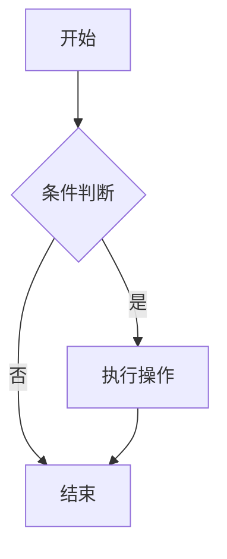

# @tc/md - 多框架 Markdown 渲染组件库

基于 [unified](https://unifiedjs.com/) 生态的高性能 Markdown 渲染组件库，支持 **React** 和 **Vue 3**，专为流式渲染场景优化。

📖 **[在线文档](http://43.163.201.189/md/latest/?path=/docs/%E7%AE%80%E4%BB%8B--docs)** | 🔗 **[GitHub](https://github.com/superlc/tc-markdown)**

## 为什么选择 @tc/md？

### 🚀 流式渲染优化

专为 AI 对话、实时编辑等流式场景设计：

- **增量解析**：仅解析新增内容，避免全量重解析
- **块级缓存**：稳定块复用，减少 DOM 操作
- **智能预测**：行内标记预测补全，消除闪烁
- **速率控制**：内置输出速率控制器，支持暂停/恢复/跳过

### 🎯 开箱即用

- **GFM 支持**：表格、任务列表、删除线、自动链接
- **代码高亮**：内置 highlight.js，支持 190+ 语言
- **数学公式**：内置 KaTeX，支持 LaTeX 语法
- **Mermaid 图表**：支持流程图、时序图、类图等多种图表
- **样式内置**：提供精心设计的默认样式

### 🔌 高度可扩展

- **插件系统**：完整支持 remark/rehype 插件生态
- **组件覆盖**：自定义任意 HTML 元素的渲染
- **TypeScript**：完整的类型定义

### 📦 多框架支持

| 包 | 框架 | 描述 |
|---|---|---|
| `@tc/md-core` | 无依赖 | 解析核心，纯函数 |
| `@tc/md-react` | React 18+ | React 组件和 Hooks |
| `@tc/md-vue` | Vue 3.3+ | Vue 组件和 Composables |

## 安装

```bash
# React
pnpm add @tc/md-react

# Vue
pnpm add @tc/md-vue

# 仅核心（无框架依赖）
pnpm add @tc/md-core
```

## 快速开始

### React

```tsx
import { Markdown } from '@tc/md-react';
import '@tc/md-react/styles.css';

function App() {
  return (
    <Markdown className="markdown-body">
      # Hello World
      
      This is **Markdown** content.
    </Markdown>
  );
}
```

### Vue

```vue
<script setup>
import { Markdown } from '@tc/md-vue';
import '@tc/md-vue/styles.css';
</script>

<template>
  <Markdown class="markdown-body" :content="content" />
</template>
```

## 流式渲染

专为 AI 对话等流式场景优化，支持两种模式：

### 受控模式（推荐）

适用于自定义数据源（WebSocket、SSE 等）：

```tsx
import { StreamingMarkdown } from '@tc/md-react';

function ChatMessage({ content, isComplete }) {
  return (
    <StreamingMarkdown
      content={content}
      isComplete={isComplete}
      className="markdown-body"
    />
  );
}
```

### Source 模式

内置速率控制，适用于一次性获取完整内容后模拟流式输出：

```tsx
<StreamingMarkdown
  source={fullContent}
  outputRate="medium"  // 'slow' | 'medium' | 'fast' | 'instant'
  onComplete={() => console.log('Done')}
/>
```

### 自定义速率

```tsx
<StreamingMarkdown
  source={content}
  outputRate={{
    charsPerSecond: 100,
    chunkSize: 5,
  }}
/>
```

## 数学公式

内置 KaTeX 支持，CSS 自动懒加载：

```tsx
<Markdown math>
  行内公式：$E = mc^2$
  
  块级公式：
  $$
  \int_{0}^{\infty} e^{-x^2} dx = \frac{\sqrt{\pi}}{2}
  $$
</Markdown>
```

```tsx
// 流式渲染
<StreamingMarkdown content={content} math />
```

## 代码高亮

默认启用，支持 190+ 语言：

````tsx
<Markdown highlight>
```javascript
const greeting = 'Hello, World!';
console.log(greeting);
```
</Markdown>
````

## Mermaid 图表

支持在 Markdown 中渲染 Mermaid 图表，包括流程图、时序图、类图等：

````tsx
<Markdown mermaid>

</Markdown>
````

### 功能特性

- **动态加载**：Mermaid 库按需加载，不影响首屏性能
- **主题适配**：自动跟随浅色/暗色主题切换
- **全屏查看**：支持浏览器原生全屏 API，沉浸式体验
- **缩放平移**：鼠标滚轮缩放，拖拽平移
- **PNG 下载**：一键导出高清 PNG 图片
- **错误处理**：语法错误友好提示

```tsx
// 流式渲染
<StreamingMarkdown content={content} mermaid />
```

## 自定义组件

覆盖默认 HTML 元素的渲染：

```tsx
// React
<Markdown
  components={{
    h1: ({ children }) => <h1 className="custom-h1">{children}</h1>,
    a: ({ href, children }) => (
      <a href={href} target="_blank" rel="noopener">
        {children}
      </a>
    ),
    code: ({ className, children }) => (
      <code className={`${className} custom-code`}>{children}</code>
    ),
  }}
>
  # Custom Heading
</Markdown>
```

```vue
<!-- Vue -->
<Markdown
  :content="content"
  :components="{ h1: CustomHeading, a: CustomLink }"
/>
```

## 插件扩展

完整支持 unified 生态插件：

```tsx
import remarkMath from 'remark-math';
import rehypeKatex from 'rehype-katex';
import remarkGemoji from 'remark-gemoji';

<Markdown
  remarkPlugins={[
    { plugin: remarkMath },
    { plugin: remarkGemoji },
  ]}
  rehypePlugins={[
    { plugin: rehypeKatex, options: { strict: false } },
  ]}
>
  :rocket: $E = mc^2$
</Markdown>
```

## API 参考

### Markdown 组件

| Prop | 类型 | 默认值 | 描述 |
|------|------|--------|------|
| `content` / `children` | `string` | - | Markdown 内容 |
| `className` / `class` | `string` | - | 容器 CSS 类名 |
| `gfm` | `boolean` | `true` | 启用 GFM 扩展 |
| `highlight` | `boolean` | `true` | 启用代码高亮 |
| `math` | `boolean` | `false` | 启用数学公式 |
| `mermaid` | `boolean` | `false` | 启用 Mermaid 图表 |
| `components` | `object` | `{}` | 自定义组件映射 |
| `remarkPlugins` | `array` | `[]` | remark 插件列表 |
| `rehypePlugins` | `array` | `[]` | rehype 插件列表 |

### StreamingMarkdown 组件

| Prop | 类型 | 默认值 | 描述 |
|------|------|--------|------|
| `content` | `string` | - | 受控模式内容 |
| `source` | `string` | - | Source 模式完整内容 |
| `isComplete` | `boolean` | `false` | 受控模式完成标记 |
| `outputRate` | `string \| object` | `'medium'` | 输出速率 |
| `onComplete` | `function` | - | 完成回调 |
| `onBlockStable` | `function` | - | 块稳定回调 |
| `onProgress` | `function` | - | 进度回调 |
| `minUpdateInterval` | `number` | `16` | 最小更新间隔(ms) |

### Hooks / Composables

```tsx
// React
import { useMarkdown, useStreamingMarkdown } from '@tc/md-react';

const html = useMarkdown(content, { gfm: true, highlight: true });

const { blocks, isComplete, stats } = useStreamingMarkdown({
  content,
  onComplete: () => {},
});
```

```ts
// Vue
import { useMarkdown, useStreamingMarkdown } from '@tc/md-vue';

const html = useMarkdown(content, { gfm: true });

const { blocks, isComplete } = useStreamingMarkdown({
  content: contentRef,
});
```

## 性能优化

### 流式渲染原理

```
输入流: "# Hello\n\nWorld"
          ↓
     增量解析器
          ↓
    ┌─────────────────┐
    │ Block 1: # Hello │ ← 稳定，缓存复用
    │ Block 2: World   │ ← 更新中
    └─────────────────┘
          ↓
     Keyed VNodes
          ↓
    最小化 DOM 更新
```

### 性能指标

- **增量解析**：仅解析 diff，复杂度 O(n) → O(Δn)
- **块级缓存**：稳定块 0 重渲染
- **更新节流**：默认 60fps，可配置

## 浏览器支持

- Chrome 90+
- Firefox 90+
- Safari 14+
- Edge 90+

## 开发

```bash
# 安装依赖
pnpm install

# 启动 Storybook
pnpm dev

# 构建
pnpm build

# 测试
pnpm test
```

## License

MIT
