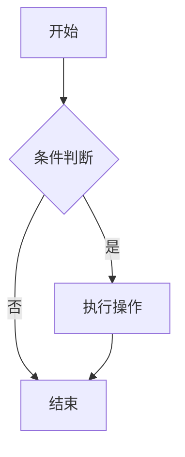

# @superlc/md-react

基于 [@superlc/md-core](https://www.npmjs.com/package/@superlc/md-core) 的 React Markdown 渲染组件，专为流式渲染场景优化。

[](https://www.npmjs.com/package/@superlc/md-react)
[](https://www.npmjs.com/package/@superlc/md-react)

📖 **[在线文档](http://43.163.201.189/md/latest/?path=/docs/%E7%AE%80%E4%BB%8B--docs)** | 🔗 **[GitHub](https://github.com/superlc/tc-markdown/tree/main/packages/react)**

## 功能特性

- 🌊 **流式渲染** - 专为 AI 对话、实时编辑等场景优化
- 🚀 **高性能** - 增量解析、块级缓存、最小化 DOM 更新
- 📐 **数学公式** - 内置 KaTeX 支持，CSS 懒加载
- 🎨 **代码高亮** - 内置 highlight.js，支持 190+ 语言
- 📊 **Mermaid 图表** - 支持流程图、时序图、类图等
- 🔌 **插件扩展** - 完整支持 remark/rehype 插件生态
- 🎭 **组件覆盖** - 自定义任意 HTML 元素的渲染
- 🔒 **类型安全** - 完整的 TypeScript 类型定义

## 安装

```bash
# npm
npm install @superlc/md-react

# pnpm
pnpm add @superlc/md-react

# yarn
yarn add @superlc/md-react
```

### 可选依赖

```bash
# Mermaid 图表支持
pnpm add mermaid
```

## 快速开始

### 基础使用

```tsx
import { Markdown } from '@superlc/md-react';
import '@superlc/md-react/styles.css';

function App() {
  return <Markdown className="markdown-body"># Hello World This is **Markdown** content.</Markdown>;
}
```

### 流式渲染

#### 受控模式（推荐）

适用于自定义数据源（WebSocket、SSE 等）：

```tsx
import { StreamingMarkdown } from '@superlc/md-react';

function ChatMessage({ content, isComplete }) {
  return <StreamingMarkdown content={content} isComplete={isComplete} className="markdown-body" />;
}
```

#### Source 模式

内置速率控制，适用于模拟流式输出：

```tsx
import { StreamingMarkdown } from '@superlc/md-react';

function Demo() {
  return (
    <StreamingMarkdown
      source={fullContent}
      outputRate="medium" // 'slow' | 'medium' | 'fast' | 'instant'
      onComplete={() => console.log('Done')}
    />
  );
}
```

#### 自定义速率

```tsx
<StreamingMarkdown
  source={content}
  outputRate={{
    charsPerSecond: 100,
    chunkSize: 5,
  }}
/>
```

### 数学公式

```tsx
<Markdown math>
  行内公式：$E = mc^2$

  块级公式：
  $$
  \int_{0}^{\infty} e^{-x^2} dx = \frac{\sqrt{\pi}}{2}
  $$
</Markdown>
```

### 代码高亮

````tsx
<Markdown highlight>
  ```javascript const greeting = 'Hello, World!'; console.log(greeting); ```
</Markdown>
````

### Mermaid 图表

````tsx
import { Markdown } from '@superlc/md-react';

<Markdown mermaid>

</Markdown>
````

**Mermaid 功能特性：**

- 动态加载：按需加载，不影响首屏性能
- 主题适配：自动跟随浅色/暗色主题
- 全屏查看：支持浏览器原生全屏 API
- 缩放平移：鼠标滚轮缩放，拖拽平移
- PNG 下载：一键导出高清 PNG 图片

### 自定义组件

```tsx
<Markdown
  components={{
    h1: ({ children }) => <h1 className="custom-h1">{children}</h1>,
    a: ({ href, children }) => (
      <a href={href} target="_blank" rel="noopener">
        {children}
      </a>
    ),
    code: ({ className, children }) => (
      <code className={`${className} custom-code`}>{children}</code>
    ),
  }}
>
  # Custom Heading
</Markdown>
```

### 插件扩展

```tsx
import remarkEmoji from 'remark-emoji';
import rehypeSlug from 'rehype-slug';

<Markdown remarkPlugins={[{ plugin: remarkEmoji }]} rehypePlugins={[{ plugin: rehypeSlug }]}>
  :rocket: # Hello
</Markdown>;
```

### 使用 Hooks

```tsx
import { useMarkdown, useStreamingMarkdown } from '@superlc/md-react';

// 静态渲染
function StaticContent({ content }) {
  const element = useMarkdown(content, { gfm: true, highlight: true });
  return <div className="markdown-body">{element}</div>;
}

// 流式渲染
function StreamingContent({ content, isComplete }) {
  const { blocks, stats } = useStreamingMarkdown({
    content,
    isComplete,
    onComplete: () => console.log('Done'),
  });

  return (
    <div className="markdown-body">
      {blocks.map((block) => (
        <div key={block.key}>{block.element}</div>
      ))}
    </div>
  );
}
```

## API 参考

### Markdown 组件

| Prop            | 类型      | 默认值  | 描述              |
| --------------- | --------- | ------- | ----------------- |
| `children`      | `string`  | -       | Markdown 内容     |
| `className`     | `string`  | -       | 容器 CSS 类名     |
| `gfm`           | `boolean` | `true`  | 启用 GFM 扩展     |
| `highlight`     | `boolean` | `true`  | 启用代码高亮      |
| `math`          | `boolean` | `false` | 启用数学公式      |
| `mermaid`       | `boolean` | `false` | 启用 Mermaid 图表 |
| `components`    | `object`  | `{}`    | 自定义组件映射    |
| `remarkPlugins` | `array`   | `[]`    | remark 插件列表   |
| `rehypePlugins` | `array`   | `[]`    | rehype 插件列表   |

### StreamingMarkdown 组件

| Prop                | 类型               | 默认值     | 描述                |
| ------------------- | ------------------ | ---------- | ------------------- |
| `content`           | `string`           | -          | 受控模式内容        |
| `source`            | `string`           | -          | Source 模式完整内容 |
| `isComplete`        | `boolean`          | `false`    | 受控模式完成标记    |
| `outputRate`        | `string \| object` | `'medium'` | 输出速率            |
| `onComplete`        | `function`         | -          | 完成回调            |
| `onBlockStable`     | `function`         | -          | 块稳定回调          |
| `onProgress`        | `function`         | -          | 进度回调            |
| `minUpdateInterval` | `number`           | `16`       | 最小更新间隔(ms)    |

### MermaidBlock 组件

| Prop           | 类型                  | 默认值   | 描述             |
| -------------- | --------------------- | -------- | ---------------- |
| `code`         | `string`              | -        | Mermaid 图表代码 |
| `streamStatus` | `'loading' \| 'done'` | `'done'` | 流式状态         |

### useMarkdown Hook

```tsx
function useMarkdown(content: string, options?: MarkdownOptions): React.ReactElement;
```

### useStreamingMarkdown Hook

```tsx
function useStreamingMarkdown(options: {
  content: string;
  isComplete?: boolean;
  onComplete?: () => void;
  onBlockStable?: (block: Block) => void;
}): {
  blocks: Block[];
  isComplete: boolean;
  stats: { totalBlocks: number; stableBlocks: number };
};
```

## 样式

```tsx
// 引入默认样式
import '@superlc/md-react/styles.css';
```

样式包含：

- 基础 Markdown 排版
- 代码高亮主题（亮色/暗色自动切换）
- 数学公式样式
- 表格、任务列表等 GFM 样式
- Mermaid 图表容器样式

## 浏览器支持

- Chrome 90+
- Firefox 90+
- Safari 14+
- Edge 90+

## 相关包

| 包                                                                 | 描述           |
| ------------------------------------------------------------------ | -------------- |
| [@superlc/md-core](https://www.npmjs.com/package/@superlc/md-core) | 解析核心库     |
| [@superlc/md-vue](https://www.npmjs.com/package/@superlc/md-vue)   | Vue 3 渲染组件 |

## License

MIT
